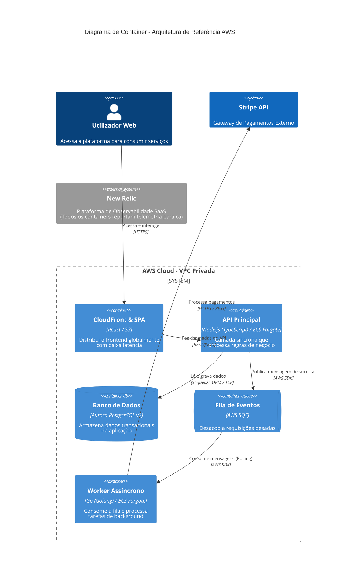

# Guia de C4 Model e Diagramas (Mermaid.js)

Este guia orienta os agentes `build-architect` sobre como estruturar, gerar e entregar diagramas visuais profissionais utilizando a extensão nativa de C4 Model do Mermaid.js.

## 1. Abordagem C4 Model
Para manter a clareza e evitar diagramas excessivamente complexos ("spaghetti architecture"), foque estritamente em dois níveis do C4 Model:

- **Nível 1: Diagrama de Contexto (`C4Context`):** Mostra o sistema como uma caixa preta, os seus utilizadores (personas) e os sistemas externos com os quais interage (ex: Gateways de pagamento, CRM externo).
- **Nível 2: Diagrama de Containers (`C4Container`):** Abre a caixa preta do sistema e mostra os "containers" que compõem a arquitetura (ex: APIs Node.js, filas SQS, bases de dados RDS, Single Page Applications).

## 2. Padrões de Código e Sintaxe (Skin C4 Oficial)
Você **NUNCA** deve usar fluxogramas genéricos (`graph TD` ou `graph LR`). Você deve obrigatoriamente usar a sintaxe `C4Context` ou `C4Container`.

### Elementos e Funções Permitidas:
* `Person(alias, "Nome", "Descrição/Papel")` - Para usuários/atores.
* `System(alias, "Nome", "Descrição")` - Para sistemas completos ou externos.
* `System_Ext(alias, "Nome", "Descrição")` - Para sistemas externos de suporte (ex: New Relic).
* `Container(alias, "Nome", "Tecnologia", "Descrição")` - Para microsserviços, APIs, Frontends.
* `ContainerDb(alias, "Nome", "Tecnologia", "Descrição")` - Para bancos de dados (renderiza formato de cilindro).
* `ContainerQueue(alias, "Nome", "Tecnologia", "Descrição")` - Para filas e tópicos de mensageria (SQS, SNS, EventBridge, Kafka).
* `System_Boundary(alias, "Nome") { ... }` - Para agrupar componentes (ex: Fronteira da AWS ou VPC).
* `Rel(origem, destino, "Ação/Relação", "Tecnologia/Protocolo")` - Para setas de comunicação.

### Regras Rigorosas de Layout e Limpeza Visual:
* **Quebra de Linha:** Se a descrição de um container ou sistema for maior que 5 ou 6 palavras, você DEVE usar a tag `<br>` para quebrar a linha manualmente (ex: `"Consome a fila SQS<br>e processa o dado"`), evitando que o texto fique encavalado ou sobreposto.
* **Preocupações Transversais (Observabilidade/New Relic):** **NUNCA** crie setas (`Rel`) de todos os componentes para serviços de Observabilidade, Logs ou IAM. Isso destrói o visual do diagrama. Declare o New Relic como um `System_Ext` isolado e coloque-o **NO FINAL DO ARQUIVO MERMAID**, para que o renderizador o jogue no rodapé. Mencione a presença do New Relic apenas no campo de tecnologia ou descrição dos outros containers.

### Exemplo de Estrutura de Código Válida (Nível 2 - Container)
Sempre encapsule o código em um bloco de Markdown marcado com ` ```mermaid ` conforme o exemplo abaixo:



## 3. Estrutura de Entrega (Obrigatório e Otimizado para Tokens)
Quando o diagrama for gerado para consolidar a documentação final, esta estrutura de três partes **DEVE ser inserida DIRETAMENTE DENTRO DO ARQUIVO DE DOCUMENTAÇÃO** (ex: na seção correspondente do ADR). **NUNCA** gere esta saída solta no chat/terminal.

Para economia de tokens e leitura dinâmica, seja absurdamente conciso. A estrutura a ser injetada no documento é exatamente esta:

1.  **O Diagrama:** O bloco de código ```mermaid gerado com as regras acima. Use descrições curtas nos containers (máximo 4 a 5 palavras).
2.  **Em resumo (Visão Técnica):** MÁXIMO de 3 bullet points curtos focados apenas no fluxo de dados e serviços AWS.
3.  **Em resumo (Visão de Negócio):** MÁXIMO de 2 frases. Explique *o que* resolve e *por que* é seguro/barato com uma analogia simples, sem jargões.
